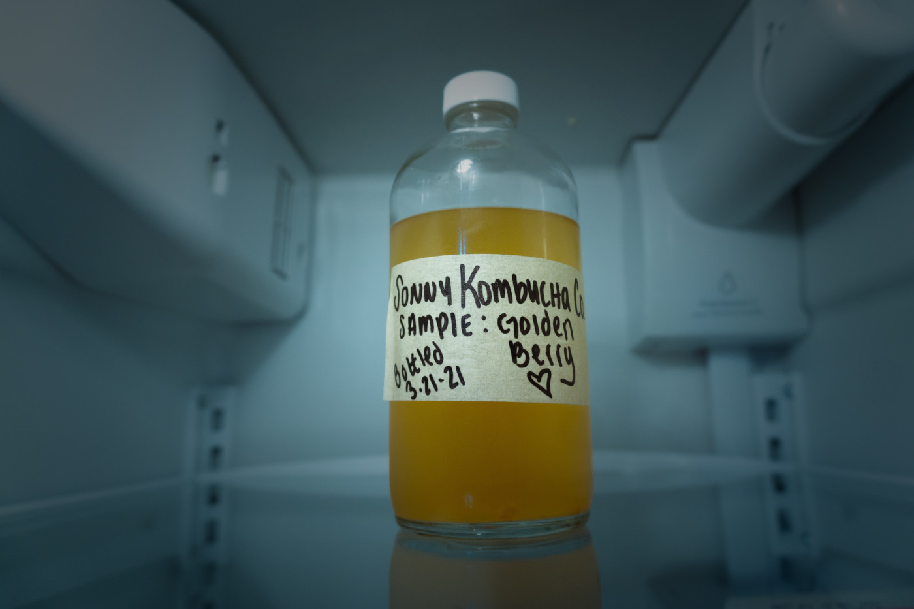

# Scoby

Generic Kubernetes controller for simple workloads.


> photo by [Harrison Kugler](https://unsplash.com/@harrisonkugler?utm_source=unsplash&utm_medium=referral&utm_content=creditCopyText)

## Description

Scoby is a controller that generates controllers :infinity:, and makes it easy to manage application instances as Kubernetes objects.

Registrations are the core object of Scoby, they contain references to user a provided container image,a CRD, and workload generation parameters.

- The container image provided at the registration must receive parameters via environment variables.
- The CRD must contain all supported parameters and validations. Scoby does not add extra validations and parses user created objects without comparing with the registered CRD.
- Workloads generated by Scoby can be Deployments (with optional Service) or Knative Services. Custom Resource instances will generate environment variables that can be highly customized.

Registered CRDs will get a controller that reacts to object instances in a strictly declarative manner.


## Install

We are still in a very early stage of the project, there is no formal installation.

To setup a development environment:

```console
# Apply registration
kubectl apply -f config/scoby.triggermesh.io_crdregistrations.yaml

# Run controller
go run cmd/controller/main.go
```

## Usage

Any valid CRD that is valid for Kubernetes will work with Scoby. If the CRD contains the status subresource and it adheres to the [recommended structure](docs/status.md), Scoby will fill it upon reconciliation.

A `CRDRegistration` object contains:

- `formFactor` determines the objects that will be created for each instance of the Custom Resource created.
- `parameterConfiguration` hints how to parse elements in the Custom Resource to convert them to environment variables that will be consumed by the container.

This example registration creates a controller for the user provided CRD `my-example.existing.crd` and image `my-repo/my-example:v1.0.0`:

```yaml
apiVersion: scoby.triggermesh.io/v1alpha1
kind: CRDRegistration
metadata:
  name: my-example-registration
spec:
  crd: my-example.existing.crd
  workload:
    formFactor:
      deployment:
        replicas: 1
        service:
          port: 80
          targetPort: 8080
    fromImage:
      repo: my-repo/my-example:v1.0.0
    parameterConfiguration:
      customize:
      - path: spec.account.name
        render:
          key: MY_EXAMPLE_AUTH_USER
      - path: spec.account.passwordSecret
        render:
          key: MY_EXAMPLE_AUTH_PASSWORD
          valueFromSecret:
            name: spec.account.passwordSecret.name
            key: spec.account.passwordSecret.key
```

- At the `spec.workload.formFactor` section it is instructed to create a deployment and connect it with a service that will expose port 80 externally and redirect requests to 8080 at the container.
- The image for the deployment is referenced at `.spec.workload.fromImage.repo`
- Parameters for the deployment's container will be customized following `.spec.workload.parameterConfiguration` rules.
  - If Custom Resources created by users contain a `.spec.account.name` element, an environment variable named `MY_EXAMPLE_AUTH_USER` will be created using the element's value.
  - If Custom Resources created by users contain a `.spec.account.passwordSecret` element, an environment variable named `MY_EXAMPLE_AUTH_PASSWORD` will be created using a Kubernetes secret reference as value.

For further information

- :computer_mouse: Start using Scoby with the [getting started guide](docs/getting-started/README.md).
- :bookmark_tabs: Learn more about registration at the [registration documentation](docs/registration.md).
