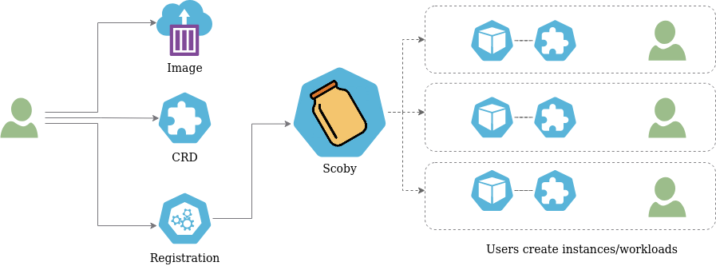

[](https://goreportcard.com/report/github.com/triggermesh/scoby)
[](https://github.com/triggermesh/scoby/releases)
[](https://join.slack.com/t/triggermesh-community/shared_invite/zt-1kngevosm-MY7kqn9h6bT08hWh8PeltA)

Generic Kubernetes controller for simple workloads.


> photo by [Harrison Kugler](https://unsplash.com/@harrisonkugler?utm_source=unsplash&utm_medium=referral&utm_content=creditCopyText)

## Description

Scoby is a controller that creates controllers dynamically :infinity:, and makes it easy to manage your application instances as Kubernetes objects.

In shoft, Scoby is the shortest path between your application's container image and Kubernetes end users.



Given a container image containinng an application, a Kubernetes CRD that defines the application spec, and an Scoby registration that configures rendering, end users will be able to manage instances of your application at Kubernetes.

## Primer

There are 3 steps needed to create your Kubernetes native application:

- Build the image: create a container image that Scoby can use. Parameters need to be passed via environment variables.
- Create the CRD: Scoby will use the CRD elements to create the environment variables that your application needs. Make sure your add all your validations via CRD.
- Create the CRDRegistration: the registration informs Scoby about how the CRD elements are transformed into environment variables, what image to use, and what type of workload should be created.

A registration could look as simple as this:

```yaml
apiVersion: scoby.triggermesh.io/v1alpha1
kind: CRDRegistration
metadata:
  name: myapp
spec:
  crd: myapp.myorganization.io
  workload:
    fromImage:
      repo: myorganization/myapp:v1
```

## Install

To install Scoby at a Kubernetes cluster apply manifests for both CRDs and Controller:

```console
# Install Scoby CRDs
kubectl apply -f https://github.com/triggermesh/scoby/releases/latest/download/scoby-crds.yaml

# Install Scoby Controller
kubectl apply -f https://github.com/triggermesh/scoby/releases/latest/download/scoby.yaml
```

Refer to [releases](https://github.com/triggermesh/scoby/releases) for further information.

### Development Version

Development version can be installed using [ko](https://github.com/ko-build/ko)

```console
ko apply -f ./config
```

## Usage

Any valid CRD that is valid for Kubernetes will work with Scoby. If the CRD contains the status subresource and it adheres to the [recommended structure](docs/status.md), Scoby will fill it upon reconciliation.

A `CRDRegistration` object contains:

- `formFactor` determines the objects that will be created for each instance of the Custom Resource created.
- `parameterConfiguration` hints how to parse elements in the Custom Resource to convert them to environment variables that will be consumed by the container.

This example registration creates a controller for the user provided CRD `my-example.existing.crd` and image `my-repo/my-example:v1.0.0`:

```yaml
apiVersion: scoby.triggermesh.io/v1alpha1
kind: CRDRegistration
metadata:
  name: my-example-registration
spec:
  crd: my-example.existing.crd
  workload:
    formFactor:
      deployment:
        replicas: 1
        service:
          port: 80
          targetPort: 8080
    fromImage:
      repo: my-repo/my-example:v1.0.0
    parameterConfiguration:
      customize:
      - path: spec.account.name
        render:
          key: MY_EXAMPLE_AUTH_USER
      - path: spec.account.passwordSecret
        render:
          key: MY_EXAMPLE_AUTH_PASSWORD
          valueFromSecret:
            name: spec.account.passwordSecret.name
            key: spec.account.passwordSecret.key
```

- At the `spec.workload.formFactor` section it is instructed to create a deployment and connect it with a service that will expose port 80 externally and redirect requests to 8080 at the container.
- The image for the deployment is referenced at `.spec.workload.fromImage.repo`
- Parameters for the deployment's container will be customized following `.spec.workload.parameterConfiguration` rules.
  - If Custom Resources created by users contain a `.spec.account.name` element, an environment variable named `MY_EXAMPLE_AUTH_USER` will be created using the element's value.
  - If Custom Resources created by users contain a `.spec.account.passwordSecret` element, an environment variable named `MY_EXAMPLE_AUTH_PASSWORD` will be created using a Kubernetes secret reference as value.

For further information

- :computer_mouse: Start using Scoby with the [getting started guide](docs/getting-started/README.md).
- :bookmark_tabs: Learn more about registration at the [registration documentation](docs/registration.md).
